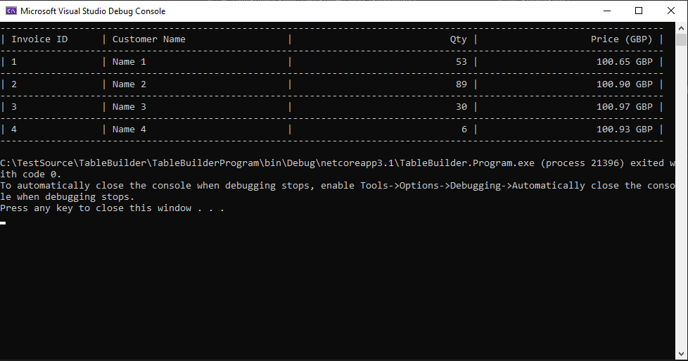

# TableBuilder
 A demo code to to build table with different type of columns
 This shows how multiple design patterns help to solve the issue:
 - Strategy Pattern: render different output with different types of column.
 - Bridge Pattern: decouple rendering cell task from the table to columns (so we can have same/different column implementation for different types of table).
 
 Why:
 - We need to build a table which which displayed selected properties of an object. It needs to recognize the type of the property and format the displayed value accordingly. (Eg. int value will be displayed as 1,000 and right aligned, money value is displayed as 1000 GBP, ...)
 - There will be more and more different formatting for different type of values. Hence, displaying implementations need to be extended easily.
 - Moreover, it should allow easily to extend to have more types of headers / footers (paging footer, total footer).
 
 What Next:
 - I'd like to use decoration pattern to demonstrate how we can build header grouping that build on top of normal header.
 - In the demo, there are only 3 types of column (int, money, string), there hopefully will be more types, as well as more options.
 
 Output of the app display a table as below
 
